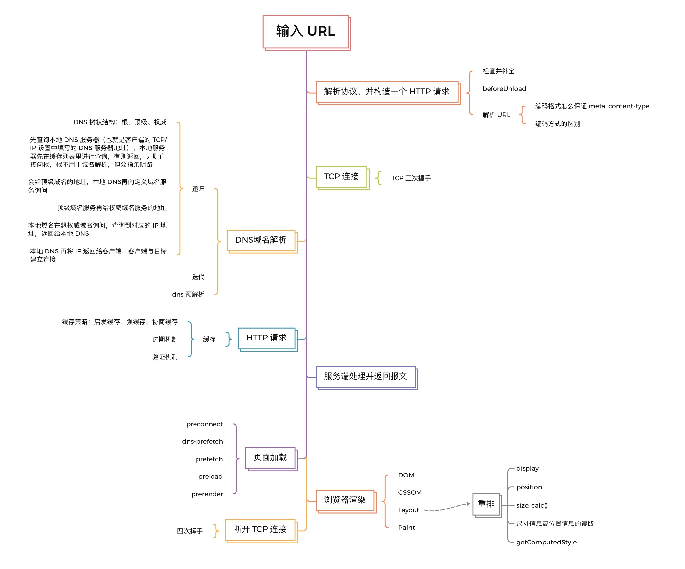
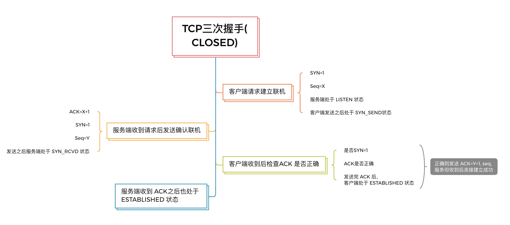
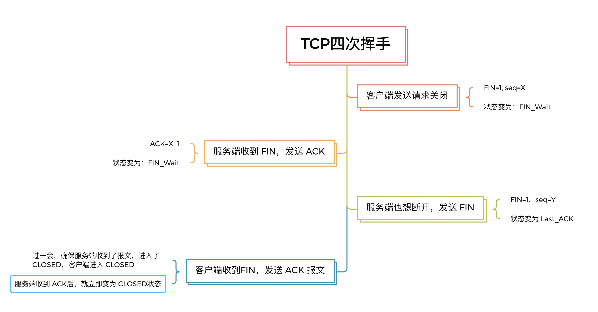
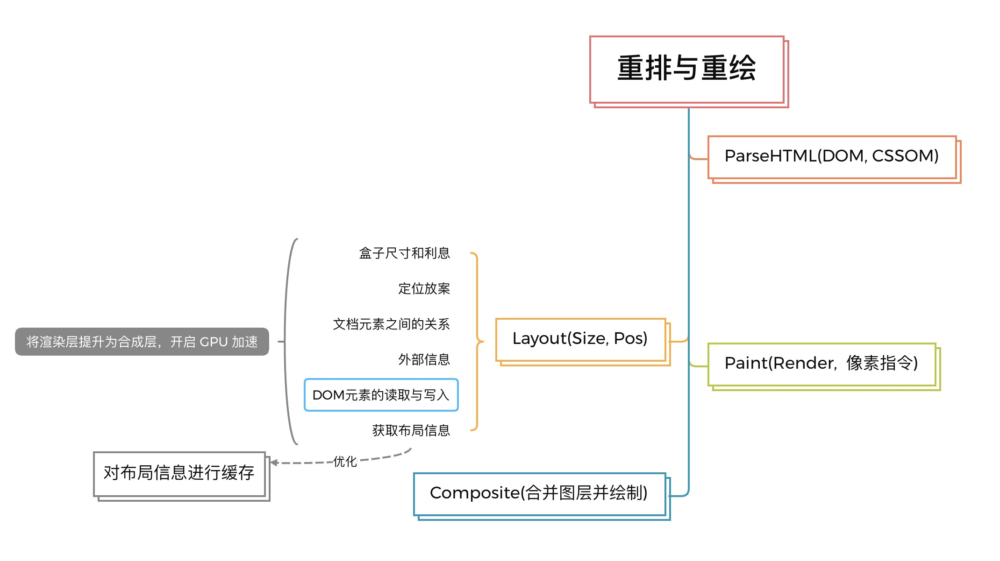

### 输入 URL 后发生了什么？

#### Url 输入到请求的步骤？



+ 解析协议、主机、端口号、路径等信息，并构造一个 HTTP 请求
+ DNS 域名解析
+ TCP连接
+ HTTP 请求
+ 服务器处理请求并返回报文
+ 浏览器渲染页面
+ 断开 TCP 连接

1. 从浏览器地址栏输入url到请求返回发生了什么？url 解析，dns 系统查询 IP

   + 输入网址需要完成：
     + 检查是否符合 URL 规则，根据规则加上协议，补全成完整的 URL
     + 回车后：浏览器会给当前页面执行一次 beforeunload，允许页面在退出之前做一些清理工作，比如询问是否要离开？表单是否要提交

2. url为啥要解析，dns查询规则是什么？

   + 解析 URL
      + URL: 协议、主机、端口、路径、查询参数、锚点

3. url编码的规则是什么呢？utf-8，中文的话用gb2312编码吗，还有就是万一浏览器不是你说的这样统一用utf-8，你怎么保证都是utf-8的编码?
   + meta 标签主要有两个属性：
   + name『keywords, description, viewport, renderer 何种方式渲染』
   + http-equiv「名称/值」指示服务器在发送实际的文档之前先在要传送给浏览器的 MIME 文档头部包含名称/值对
     + Content-type：网页编码格式，告诉浏览器使用何种编码进行解码 \<meta http-equiv="Content-Type" content="text/html; charset=utf-8"/>
     + 还包括：Content-Language：\<meta http-equiv="Content-Language" content="zh-cn"/>
     + Expires：\<meta http-equiv="Expires" content="-10"/>
     + Pragma：\<meta http-equiv="Pragma" content="no-cache"/>
     + Cache-Control 指定请求和响应遵循的缓存机制。
     + Set-Cookie(cookie设定)
     + Refresh(刷新)
     + Window-target：强制页面在当前窗口以独立页面显示，防止自己的页面被其他网页以 frame 调用
     + X-UA-Compatible：IE8 浏览器专用
4. encodeURIComponent 和 encodeURI 及 escape 有什么区别?
   + 编码范围不同，escape 用于对字符串的编码，不适用于 URL 编码，不会编码的字符有 69 个：`* + - . / @ _ 0-9 a-z A-Z`
   + encodeURIComponent 的编码范围比 encodeURI 的大，不会编码的字符有 71 个：`! ' ( ) * - . _ ~ 0-9 a-z A-Z`，对参数编码一般用 encodeURIComponent，如果用它对 host 和 path 进行编码，会导致“/”也被编码，导致 URL 不可用
   + 对整个 URL 编码一般用 encodeURI，不会编码的字符有 82 个：`; , / ? : @ & = + $ - _ . ! ~ * ' ( ) # 0-9 a-z A-Z`
5. dns 系统如何查询 IP？host-->本地 dns 解析器缓存-->本地 dns 服务器缓存
   + DNS 域名解析：递归和迭代过程----根、顶、权威
     + 将报文转发到根 DNS 服务器
     + 根 DNS 服务器根据.com 前缀，返回给本地 DNS 服务器对应的`顶级 DNS` 服务器的 `IP 地址列表`
     + 本地 DNS 服务器向其中一台顶级 DNS 服务器发送查询报文
     + 该 DNS 服务器注意到 报文的 .com前缀，便向本地 DNS 服务器返回`权威 DNS` 服务器的 IP 地址
     + 本地 DNS 服务器又向其中一台权威服务器发送查询报文；
     + 主机 m.n.com 向本地 DNS 服务器 dns.n.com 发出的查询就是递归查询，而后继的三个查询是迭代查询----有的请求都是由本地 DNS 服务器发出，所有的响应都是直接返回给本地 DNS 服务器。
     + 有了缓存，大多数 DNS 查询都绕过了根 DNS 服务器，需要向根 DNS 服务器发起查询的请求很少。
6. html如何做dns优化，dns 预解析
   + 第一次的域名DNS解析查找流程依次为：浏览器缓存 ->系统缓存 ->路由器缓存 ->ISP DNS缓存 ->递归搜索
     + 用meta信息来告知浏览器, 当前页面要做DNS预解析:<meta http-equiv="x-dns-prefetch-control" content="on" />
     + 在页面header中使用link标签来强制对DNS预解析:<link rel="dns-prefetch" href="http://bdimg.share.baidu.com" />
     + 注意：dns-prefetch需慎用，多页面重复DNS预解析会增加重复DNS查询次数

```html
<meta http-equiv="x-dns-prefetch-control" content="on" />
<link rel="dns-prefetch" href="http://bdimg.share.baidu.com" />
```

7. 建立 TCP 链接，三次握手

   + TCP/IP 连接
   + SYN(synchronous建立联机)
   + ACK(acknowledgement 确认)
   + PSH(push传送)
   + FIN(finish结束)
   + RST(reset重置)
   + URG(urgent紧急)
   + 三次握手：确保客户端 和 服务端都有发送和接收的能力，不然容易出现丢包的现象。
      + 一次：客户端请求建立联机 SYN=1 和 Seq = X 数据包，第一次握手可以确认客服端的发送能力
      + 二次：服务器收到请求后，想客户端发送 ACK = X + 1 和 SYN = 1, Seq = Y 到客户端，第二次握手确认了服务端的发送能力和接收能力，
      + 三次：客户端收到后检查 ACK是否正确，SYN是否是 1正确，正确则在发送 ACK = Y + 1，seq; 服务端收到并确认 ACK 与 Seq 的值，则建立连接成功；第三次握手才可以确认客户端的接收能力


1. 建立http请求，[http详细讲解](./http2.md)

   + http 请求
     + 连接建立之后，浏览器端会构建请求行、请求头等请求信息
     + http2.0的主要特点: 二进制分帧效率高、多路复用，头部压缩，可以进行服务端推送
   + 服务器请求并返回 http 报文
   + 断开连接
     + 四次挥手：刚开始初级 established 状态，加入客户端先发起关闭请求
     + 客户端 FIN=1 和 seq = X，客户端处于FIN_Wait状态
     + 服务端收到 FIN，发送 ACK = X + 1，服务端处于FIN_Wait状态
     + 服务端也想断开，又发送 FIN 报文 和 seq = Y，服务端处于 Last_ACK状态
     + 客户端发生 ACK 报文，过一阵子，以确保服务端收到报文后进入 CLOSED，服务端收到 ACK后就处于 CLOSED 了


9.  从网卡把数据包传输出去到服务器发生了什么，提示我OSI参考模型？
    1. 解析 URL
    2. 查询真实的地址-----DNS 解析
    3. OSI：
       1. 应用层：HTTP 数据
       2. 传输层：TCP 头部 + HTTP 数据
       3. 网络层：IP 头部 + TCP 头部 + HTTP 数据
       4. 物理层：以太网头部 + TCP 头部 + HTTP 数据（把二进制数字信息转换成电信号）「网卡、交换机、路由器」
       5. 到服务端后，开始扒皮数据包
       6. 查看是否和服务器自己的 MAC 地址符合，符合就将包收起来
       7. 继续扒开数据包的 IP 头，发现 IP 地址符合，根据 IP 头中协议项，知道自己上层是 TCP 协议
       8. 扒开 TCP 的头，里面有序列号，需要看一看这个序列包是不是我想要的，如果是就放入缓存中然后返回一个 ACK，如果不是就丢弃。TCP头部里面还有端口号， HTTP 的服务器正在监听这个端口号。
       9. 于是服务器就知道是 HTTP 进程想要这个包，于是就将包发给 HTTP 进程。
       10. HTTP 响应报文也需要穿上 TCP、IP、MAC 头部，不过这次是源地址是服务器 IP 地址，目的地址是客户端 IP 地址。
       11. 穿好头部衣服后，从网卡出去，交由交换机转发到出城的路由器，路由器就把响应数据包发到了下一个路由器，就这样跳啊跳跳到了客户端的城门把手的路由器，路由器扒开 IP 头部发现是要找城内的人，于是把包发给了城内的交换机，再由交换机转发到客户端。
       12. 后面客户端开始扒皮，只剩下 HTTP 响应报文后，交给浏览器去渲染页面，一份特别的数据包快递，就这样显示出来了！
10. 缓存读取顺序？[服务端缓存存在的问题与解决方案](./cache-question.md)
    1. memory cache/ preload cache
    2. service worker
    3. disk cache/ http cache
    4. push cache
11. from disk cache 和 from memory cache主要适用的场景？
    + HTTP 缓存分类：按缓存位置：service worker, memory cache, disk cache(HTTP cache), 网络请求
    + memory cache: `关闭 Tab` 则缓存清除, `preload 请求`的资源会被放入 memory cache 中; memory cache 可以保证相同的资源地址多次请求，只请求最多一次
    + disk cache: 持久缓存，会严格根据 HTTP 头信息中的各类字段判定资源状态，是否是可用缓存，是否过时，命中从磁盘缓存读取资源
    + cache-control: public,max-age, private代理服务器不能缓存, no-cache 客户端缓存了内容，是否使用内容由后续的对比决定, no-store
    + max-age:0, must-revalidate 和 no-cache 大致上是一致的
    + 强制缓存：直接减少请求数，提升最大的缓存策略；字段 Cache-control和 Expirs-----配合文件 Hash 使用
      + Expires, HTTP1.0字段，缓存到期时间(绝对时间)，用户在客户端本地的时间进行修改，会造成浏览器缓存失效，时差和误差也会导致缓存失效；写法也复杂
      + Cache-control，max-age 最大缓存时间(相对时间)，must-revalidate 超过时间，浏览器必须向服务器发送请求，验证资源是否还有效
    + 协商缓存：
      + 流程：浏览器请求缓存数据库，返回一个`缓存标识`；之后浏览器用这个标识和服务器通信，如果缓存未失效，返回 304表示继续使用，客户端继续使用缓存（使用什么缓存？），如果失效，则返回新数据和规则，浏览器响应后再把规则写入缓存数据库。
      + 强制缓存失效(超出规定时间)时，需要使用对比缓存，由服务器决定是否使用缓存内容，协商缓存和没有缓存在请求数上是一样的，但仅返回状态码304，在响应体积上优化了
      + last-modifed: 服务器通过改自动告知客户端，资源最后一次被修改的时间，浏览器将这个值和内容一起`记录在缓存数据库`中，下次请求相同资源时，将 If-Modified-Since: last-modified的值`写入到请求头`，和服务器中文件的最后修改时间进行对比。(只能精确到秒，不适合短时间内频繁改动的资源，也可能出现资源内容没有改变，而 Last-Modified 改变的情况)
      + If-Modified-Since `缓存校验字段`，值为资源最后一次修改的时间
      + ETag：唯一标识请求`资源的字符串(hash)`，ETag 的值缓存数据
      + If-Match：`缓存校验字段`，值为唯一标识请求资源的字符串，即 ETag 的值；If-None-Match
    + ETag 生成条件
      + 文件更改时，ETag 值必须改版
      + 必须横向扩展，分布式部署时多个服务器节点上生成的 ETag 值保持一致
      + 尽量便于计算，不会特别耗 CPU
      + Nginx 的 ETag: Last-Modified + Content-Length\<mtime, ctime\>
        1. 如果1s 内修改了文件并且保持文件大小不变，就存在问题
        2. 如果 http 响应头中 ETag 值改变了，是否意味着文件内容一定已经更改？不一定，有服务器 ETag生成算法决定
        3. Last-Modified 变了，但是 Content-Length 没变（文件内容不变），是否意味着 etag 的缓存失效？

12. 什么是启发式缓存吗，在什么条件下触发？
    + 请求没有设置 Expires 和 Cache-Control，但是响应头有设置 `Last-Modified` 信息，这种情况下浏览器会有一个默认的缓存策略：(当前时间 - Last-Modified)*0.1，这就是启发式缓存。
    + 只有在服务端没有返回明确的缓存策略时才会激活浏览器的启发式缓存策略
13. 使用缓存验证 与 过期机制的过程
    1. freshness LifeTime 的算法：如果是共享缓存：public, 如果存在s-maxage则使用，如果存在Expires首部自动，则 Expires - Date 首部字段的值，如果都没有，则使用启发式freshness计算
    2. 过期机制----Age 算法：
       + Age首部----描述一个缓存接收到响应消息的估算时长
       + Cache-Control----缓存控制，如`Cache-Control:public, max-age=31536000`包含了资源的可缓存性以及过期特性
       + Expires----提供了一个日期，在该日期之后的资源被认为是过期的（max-age > s-maxage > Expires），不可以采用极大值，存在多个 Expires 时，被视为无效
    3. 验证：使用内容散列作为验证器，记录内容散列的字段是ETag（强验证器与弱验证器）
       + Last-Modified/If-Modified-Since是显式弱验证器（精确度比 ETag 要低），用于验证收到的资源或者存储的资源是否彼此一致。存在If-None-Match，则If-Modified-Since会被忽略
       + ETag 默认为强验证器，但我们可以显示的将其指为弱验证器。如：ETag: W/"\<etag_value>"
       + ETag/If-None-Match 用于进行缓存校验
       + 条件请求机制：If-Unmodified-Since或If-Range字段携带以表示条件选择，只有当资源在指定的时间之后没有进行过修改的情况下，服务器才会返回请求的资源。如果所请求的资源在指定的时间之后发生了修改，那么会返回412错误。
       + 条件请求：If-Match 如果资源匹配才返回，不匹配返回416.
14. 解析 html 之浏览器渲染页面:
    + DOM树：字节Bytes → 字符characters → 令牌Tokens → 节点Nodes → 对象模型DOM
    + CSSOM：CSS 对象模型
    + 布局树：合并 DOM 与 CSSOM = 渲染树，再技术每个对象的精准位置和大小，渲染树将像素渲染到屏幕上
    + 渲染：
      + 获取DOM后分割为多个图层
      + 对每个图层的`节点计算样式结果` （Recalculate style--样式重计算）
      + 为每个节点`生成图形和位置` （Layout--重排,回流）
      + 将每个节点`绘制填充到图层位图`中 （Paint--重绘）
      + 图层作为纹理上传至`GPU`
      + `组合`多个图层到页面上生成最终屏幕图像 （Composite Layers--图层重组）
    + 我们可以手动打开一个图层，通过添加transform: translateZ(0) 这样回流和重绘的代价就小了，效率就会大大提高。但是不要滥用这个属性，否则会大大增加内存消耗。—— 开启GPU加速。
    + 回流: 元素的尺寸、结构、或某些属性发生改变时，浏览器重新渲染部分或全部文档的过程
    + 引起回流：
      + 页面首次渲染
      + 浏览器窗口大小发生改变
      + 元素尺寸或位置发生改变
      + 元素内容变化（文字数量或图片大小等等）
      + 元素字体大小变化
      + 添加或者删除可见的DOM元素
      + 激活CSS伪类（例如：:hover）
      + 查询某些属性或调用某些方法



1.  页面渲染优化可以从几方面入手？
    + CDN：内容分发网络（CDN）是一组分布在多个不同地理位置的 Web 服务器
    + 将 CSS 放在文件头部，JavaScript 文件放在底部
      + CSS 执行会阻塞渲染，阻止 JS 执行
      + JS 加载和执行会阻塞 HTML 解析，阻止 CSSOM 构建
    + 减少重绘、重排
      + 避免使用table布局;
      + DOM 进行批量写入和读取
      + 尽可能在DOM树的最末端改变class;
      + 避免设置多层内联样式;
      + 将动画效果应用到position属性为absolute或fixed的元素上;
      + 避免使用CSS表达式（例如：calc()）。
      + 避免频繁操作样式，最好一次性重写style属性，或者将样式列表定义为class并一次性更改class属性。
      + 避免频繁操作DOM，创建一个documentFragment，在它上面应用所有DOM操作，最后再把它添加到文档中。
      + 也可以先为元素设置display: none，操作结束后再把它显示出来。因为在display属性为none的元素上进行的DOM操作不会引发回流和重绘。
      + 避免频繁读取会引发回流/重绘的属性，如果确实需要多次使用，就用一个变量缓存起来。
      + 对具有复杂动画的元素使用绝对定位，使它脱离文档流，否则会引起父元素及后续元素频繁回流。

2.  对于页面加载可以做的部分优化:关于 link 类型[详细参见MDN](https://developer.mozilla.org/zh-CN/docs/Web/HTML/Link_types)
    + preconnect  向浏览器提供提示，建议浏览器提前打开与链接网站的连接
    + dns-prefetch  提示浏览器该资源需要在用户点击链接之前进行 DNS 查询和协议握手。
    + prefetch    建议浏览器提前获取链接的资源，因为它很可能会被用户请求
    + preload     告诉浏览器下载资源，因为在当前导航期间稍后将需要该资源
    + prerender   建议浏览器事先获取链接的资源，并建议将预取的内容显示在屏幕外

预解析预下载，都是告诉浏览器提前做这个事儿，具体是否使用，还是看是否有引用的。示例如下

```html
<head>
  <meta charset="utf-8">
  <!-- preconnect 提示最好仅用于最关键的连接 -->
  <link rel="preconnect" href="https://fonts.googleapis.com/" crossorigin>
  <link rel="dns-prefetch" href="https://fonts.googleapis.com/" >
  <title>JS and CSS preload example</title>

  <!-- preload 仅仅是告诉浏览器要下载，具体使用哪些还是要自己写引用的 -->
  <link rel="preload" href="style.css" as="style">
  <link rel="preload" href="main.js" as="script" crossorigin="anonymous">

  <link rel="stylesheet" href="style.css">

  <link rel="prerender" href="https://example.com/content/to/prerender">
  <link rel="prefetch" href="nextpage.js" crossorigin="anonymous">
</head>

<body>
  <h1>bouncing balls</h1>
  <canvas></canvas>

  <script src="main.js" defer></script>
</body>
```

17. CDN 加速原理是什么？它和外链引入js这种有什么区别？【描述】
    + CDN 即内容分发网络。CDN 的基本原理是广泛采用各种缓存服务器，将这些缓存服务器分布到用户访问相对集中的地区或网络中，在用户访问网站时，利用全局负载技术将用户的访问指向距离最近的工作正常的缓存服务器上，由缓存服务器直接响应用户请求。
    + CDN 的适用场景： 解决因分布、带宽、服务器性能带来的访问延迟问题,适用于网站站点/应用加速、点播、直播、视音频点播、大文件下载分发加速、移动应用加速等场景

18. 实现首屏300ms 打开---CSR，BSR, SSG, SSR，ISR？
    + SSR---需要一个服务器承载页面的 实时 请求、渲染和响应，这无疑会增大 服务端开发和运维 的成本
    + SSG--- 静态站点生成（SSG，也叫构建时预渲染）。在应用编译构建时`预先渲染页面，并生成静态的 HTML`。把生成的 HTML 静态资源部署到服务器后，浏览器不仅首次能请求到带页面内容的 HTML ，而且`不需要服务器实时渲染和响应`，大大节约了服务器运维成本和资源。(静态数据的场景)
    + 预渲染：
      + getStaticProps 异步函数，收集该页面组件所需要的数据返回，getStaticProps 函数执行完成后，页面组件就能在 props 中拿到这些数据并执行静态渲染---返回一个 revalidate，开启 ISR即多久重新生成一次 HTML；fallback: 'blocking'/true
      + getStaticPaths 异步函数返回的 paths，包含动态路由在构建时需要预渲染的页面数据
    + ISR：运行时重新生成每个页面 HTML，而不需要重新构建整个应用
    + 路由预加载
    + Next.js 提供 getServerSideProps 异步函数

