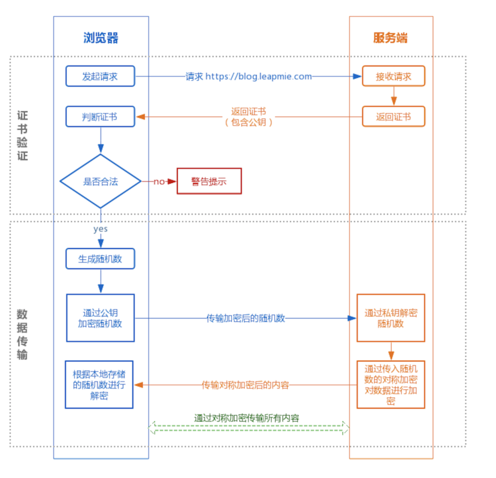

### http2 与 TSL 过程

#### http2的主要特点

+ 二进制分帧
+ 请求多路复用
+ 头部压缩:  HPack使用哈夫曼编码和索引表实现，需要客户端和服务器都维护一个`表头字段的索引表`
+ 服务器推送：有服务器根据解析 index.html 同事推送资源信息
+ 赋予请求优先级

#### 使用HTTP2的优点

+ `解析速度快`：因为 HTTP2 是基于帧的协议，每个帧都有表示帧长度的字段；服务器解析 HTTP1.1 的请求时，必须不断地读入字节，直到遇到分隔符 CRLF 为止
+ `多路复用`：多个请求可以共用一个 TCP 连接，先响应就先处理谁，这样就充分的压榨了TCP这个全双工管道的性能，当然多路复用是建立在加载的资源在同一域名下。
+ `HTTP1.1的Pipelining技术`：HTTP1.1有一个可选的Pipelining技术，即当一个HTTP连接在等待接收响应时可以通过这个连接发送其他请求，但处理响应是按照顺序的，也就是后发的请求有可能`被先发的阻塞住`，也正因此很多浏览器默认是不开启Pipelining
+ `首部压缩`：HTTP/2对消息头采用 HPACK 进行压缩传输
+ `服务器推送`：服务端可以在发送页面HTML时主动推送其它资源，而不用等到浏览器解析到相应位置，发起请求再响应。

::: tip

1. Curl 不支持 HTTP2
2. 头阻塞：出现在 TCP 层，HTTP2 多路复用的并行特性对于 TCP 的丢包恢复机制是不可见的，一个丢失或顺序不对的数据包会导致所有活动的事务停顿，无论其是否受到丢包的直接影响。因为 HTTP2 开了太多并行的 TCP 连接
3. 距离远？丢包可能性更大？
:::

::: tip 为什么 HTTP1.1 没有办法实现多路复用？

HTTP1.1为什么没有多路复用：HTTP/1.1 `不是二进制传输`，而是通过文本进行传输。由于没有流的概念，在使用并行传输（多路复用）传递数据时，接收端在接收到响应后，并`不能区分多个响应分别对应的请求`，所以无法将多个响应的结果重新进行组装，也就实现不了多路复用。
:::

#### HTTP的缺点

1. 通信使用明文，可能会被窃听
2. 不验证通信方的身份，可能遭遇伪装----查证书
3. 无法证明报文的完整性，可能被篡改----数字签名校验
4. 可通过SSL或TLS的组合使用，加密HTTP的通信内容，即HTTPS
5. HTTP是无状态协议：通过 Cookie 标识

#### HTTP3

+ 使用标准跟踪 RFC---QUIC通用的传输协议：包含流的复用和对每个流的流量控制，这两者与 HTTP/2 中实现的类似。通过在整个连接中提供流级别的可靠性和拥塞控制，比起 TCP 映射，QUIC 更能提高 HTTP 的性能
+ 支持 0-RTT QUIC 连接，减少了建立`安全 TLS 连接的数据往返次数`。

#### HTTPS 主要解决的三个安全问题

1. 握手过程主要是和服务器做通讯，生成`私有秘钥`，最后通过该秘钥`对称加密传输数据`。
2. 还有`验证证书`的正确性。 证书验证过程保证了对方是合法的，并且中间人无法通过伪造证书方式进行攻击。

+ 内容隐私
+ 防篡改
+ 确认对方身份
+ TLS----SSL 协商

#### TCP 传输层

1. 对数据进行`分割`，打上`标记序号及端口号`，发送给网络层；
2. (IP)网络层`增加MAC地址`后转发给链路层

::: tip

+ wireshark 抓包 https/http2
+ http3，基于 UDP，解决了对头阻塞与 TCP 和 TLS握手时的延迟问题
:::
