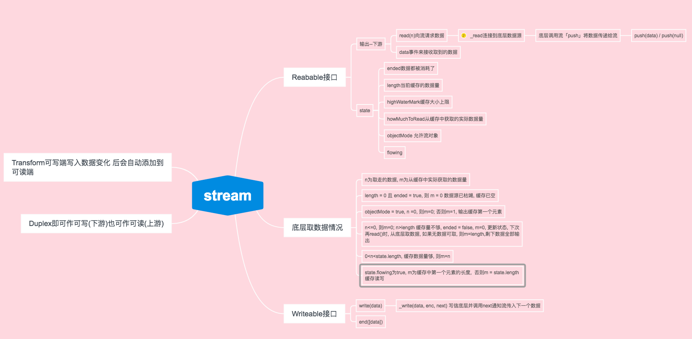

# Stream

### 流: 用于管理和处理数据, 借助事件与非阻塞I/O库, 允许在其可用的时候动态处理, 不需要的时候释放掉。
+ 流所使用的场景: API接口, 内置fs, http, 解析器, 数据库, 网络协议
+ fs.createReadStream(file).pipe(process.stdout)
  1. 连接了源头(上游, 文件)和消耗(下游, 标准输出)
  2. 流会逐次调用fs.read, 将文件内容分批取出并传给下游
  3. 上游数据被分块地连续取走, 下游收到的是一个先后到达的数据序列

### 流的可用类
+ stream.Readable: I/O上获取数据, 定制类需要自己实现\_read(size)
  1. 事件:
    1. readable：数据块可以从流中读取时发生
    2. data：有数据可读时发生
    3. end：数据读完时发生
    4. close：底层资源关闭时
    5. error：接收数据中出现错误时发生
  2. 方法:
    1. read([size])
      - 无参，返回内部缓冲区里的所有数据，无数据返回null
      - 有参，返回指定数量的数据，如果数据不足，会返回null
    2. setEncoding(encoding) 解码读到的数据
    3. pause()  暂停，不再发生data事件
    4. resume() 恢复可读流，继续发生data事件
    5. pipe(destination)
      - 把可读流输出传递给「destination指定的Writable流」,两个流组成一个管道；
      - options是一个js对象，end属性为true, 表示Readable结束时自动结束Writable;
      - 可把一个Readable与多个Writable连在一起，组成多个管道，每个Writable都能到同样的数据，方法返回destination; 如果destination本身双是一个Readable，可级联调用pipe
    6. unpipe(destination) 端口与指定destination管道，无参时，断开一这个可读流连在一起的管道。

  3. 模式: 流动模式state.flowing=true、暂停模式「可读流创建时都是暂停模式」
  4. 流动模式下, 数据会通过data事件输出, 不需要消耗方反复调用read(n)方法
  5. 初始状态下, 监听“data”事件, 会使流进入流动模式, 暂停模式下, data事件不会进入流动模式, 要消耗流, 需要显示的调用read()方法
  6. 从暂停到流动的方法有:
    1. 显式的调用read()方法, 触发data事件
    2. 显式调用resume()
  7. 调用pipe()将可读流桥接到一个可写流上
  8. 从流动到暂停的方式有:
    1. 如果这个可读的流没有桥接可写流组成管道，直接调用pause()
    2. 如果这个可读的流与若干可写流组成了管道，需要移除与“data”事件关联的所有处理器，并且调用unpipe()方法断开所有管道。

```js
var http = require('http');
var fs = require('fs');
http.createServer((req, res)=>{
  fs.createReadStream('filePath').pipe(res);
})
```

+ stream.Writable: 输出数据到底层I/O;  \_write(chunk, encoding, cb)
  1. 事件:
    1. finish： end()被调用，且所有数据都已被写入
    2. pipe：  Readable调pipe()方法时, writable发射这个事件
    3. unpipe
    4. error
    5. drain 缓存的数据被排空了
  2. 方法:
    1. writable(chunk[,encoding][,callback])  写的内容大于缓存区大小时, 返回false, 表示停止写入, 需要read()完缓存区数据, 即缓存区被排空, 触发drain事件, 可以防止缓存区爆仓
    2. end(chunk[,encoding][,callback])

+ stream.Duplex: \_read(size), \_write(chunk, encoding, cb)
  1. 常见的实现有: TCP socket, zlib, crypto

+ stream.Transform: \_flush(size), \_transform(chunk, encoding, cb)
  1. 可写端写入数据变化 后会自动添加到可读端
  2. 常见的实现有: zlib, crypto
  3. 以某种方式修改我们的双工流, 没有输入数据要匹配输出数据的限制

下面为类接口实现执行流程图



#### Node内部实现的流：

- 客户端的HTTP响应
- 服务端的HTTP请求
- fs读取流: fs.createReadStream(source,{options})
- zlib流
- crypto（加密）流
- TCP套接字
- 子进程的stdout和stderr
- process.stdin

### 错误跟踪

+ console.trace() 能够生成完整的堆栈跟踪, 会将Node核心模块event.js实现庄浪功能的地方跟踪到。
+ console.error(err.stack)

### 流的使用

> 压缩

```js
gzip = zlib.createGzip();
inFile = fs.createReadStream(file);
outGzip = fs.createWriteStream('file.gz')
inFile.pipe(gzip).pipe(outGzip)
```

> 解压

```js
var gunzip = zlib.createUnzip({flush: zlib.Z_FULL_FLUSH});
var inGzip = fs.createReadStream('readable.gz');
var outFile = fs.createWriteStream('readable.unzipped');
inGzip.pipe(gunzip).pipe(outFile);
```

### 实现一个流类的基本步骤

1. 在定义的类的构造函数中调用stream.Readable类接口
2. 定义类的原型继承stream.Readable.prototype
3. 定义原型的_read方法, 实现从底层读取数据到缓存队列。

### 优化流的缓冲区大小

1. input = fs.createReadStream(file, {bufferSize： insize})
2. output = fs.createWriteStream(file,{bufferSize: insize})
3. gzip = zlib.createGzip({chunkSize: outsize})
4. input.pipe(gzip).pipe(output)
