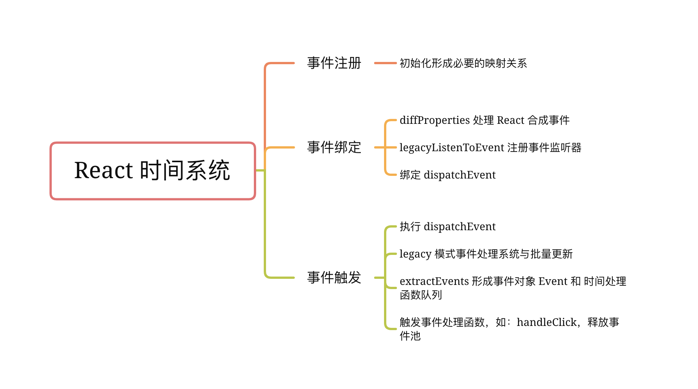
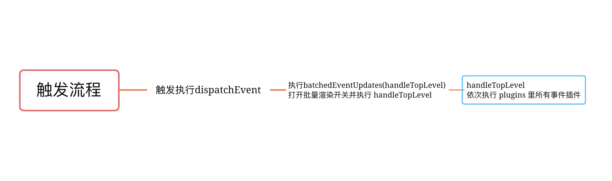

### react SyntheticEvent 事件

1. 为什么要自定义事件机制？
   1. 抹平不同浏览器的差异，实现更好的跨平台。
   2. 与内部的「优先级机制」绑定，方便事件统一管理和事务机制。
   3. 避免垃圾回收，React 引入`事件池`，在事件池中获取或释放事件对象，避免`频繁地去创建和销毁`。

#### React 时间系统的执行顺序

1. 事件初始化
2. 事件注册
3. 事件绑定
4. 事件触发



+ 初始化执行之后，fiber对象节点的 memoizedProps 和 pendingProps 保存了我们的事件
+ 声明事件保存的位置，并非是事件真正的注册的节点
+ 如：button上绑定了 oncClick 事件，但实际渲染时 button 上绑定了两个事件，一个是document上的事件监听器，另外一个是button，但事件处理函数是 noop，而是绑定在 document 上了，故结论是：

::: tip 总结

1. jsx 中的事件没有绑定在真实的对应的 dom 上，而是绑定在 `document 上统一管理`
2. 真实 dom 上的 click 事件被单独处理，被换成了空函数
3. 对于有的事件，比如onChange，绑定到 document 可能有多个事件与之对应
4. react并不是一开始，把所有的事件都绑定在document上，而是采取了一种`按需绑定`，比如发现了onClick事件,再去绑定document click事件。
:::

#### react 事件如何合成

+ namesToPlugins 装`事件名` 到 `事件模块插件`的映射
+ plugins 上面注册的所有插件列表

```js
const namesToPlugins = {
  SimpleEventPlugin, // 处理各个事件函数的插件，比如一次点击事件，就会找到SimpleEventPlugin对应的处理函数
  EnterLeaveEventPlugin,
  ChangeEventPlugin,
  SelectEventPlugin,
  BeforeInputEventPlugin,
}
const  plugins = [LegacySimpleEventPlugin, LegacyEnterLeaveEventPlugin, ...];
```

+ registrationNameModules 记录了`React合成的事件`与`对应的事件插件`的关系，处理props中事件的时候，会根据不同的事件名称，找到对应的事件插件，然后统一绑定在document上

```js
// 事件对应的事件插件
{
    onBlur: SimpleEventPlugin,
    onClick: SimpleEventPlugin,
    onClickCapture: SimpleEventPlugin,
    onChange: ChangeEventPlugin,
    onChangeCapture: ChangeEventPlugin,
    onMouseEnter: EnterLeaveEventPlugin,
    onMouseLeave: EnterLeaveEventPlugin,
    ...
}
```

+ 事件插件是什么？是一个对象，有两个属性，第一个extractEvents作为事件统一处理函数，第二个eventTypes是一个对象，对象保存了原生事件名和对应的配置项dispatchConfig的映射关系

```js
const SimpleEventPlugin = {
    eventTypes:{
        'click':{ /* 处理点击事件  */
            phasedRegistrationNames:{
                bubbled: 'onClick',       // 对应的事件冒泡 - onClick
                captured:'onClickCapture' //对应事件捕获阶段 - onClickCapture
            },
            dependencies: ['click'], //事件依赖
            ...
        },
        'blur':{ /* 处理失去焦点事件 */ },
        ...
    }
    extractEvents:function(topLevelType,targetInst,){ /* eventTypes 里面的事件对应的统一事件处理函数，接下来会重点讲到 */ }
}
```

+ registrationNameDependencies 用来记录，合成事件和原生事件的对应关系

```js
// 合成事件 与 原生事件的对应关系
{
    onBlur: ['blur'],
    onClick: ['click'],
    onClickCapture: ['click'],
    onChange: ['blur', 'change', 'click', 'focus', 'input', 'keydown', 'keyup', 'selectionchange'],
    onMouseEnter: ['mouseout', 'mouseover'],
    onMouseLeave: ['mouseout', 'mouseover'],
    ...
}
```

::: tip 初始化定义上面的对应关系

+ 事件初始化：主要形成了上述的几个重要对象，构建初始化React `合成事件` 和 `原生事件` 的对应关系，`合成事件` 和 对应的 `事件处理插件` 关系。
  1. 注册事件 injectEventPluginsByName，默认执行，形成上述的namesToPlugins
  2. 然后执行 recomputePluginOrdering 形成上面说的那个 plugins 数组
  3. 然后执行 publishEventForPlugin 形成上述的 registrationNameModules 和 registrationNameDependencies 对象中的映射关系
:::

#### react 事件绑定过程，是在 DOMDiff 阶段完成

+ 事件的处理函数保存在 fiber 节点的 memoizedProps 和 pendingProps 属性上
+ React 在调合子节点后，进入 diff 阶段，如果判断 HostComponent 是 `5 即dom元素类型`，用 diff props 函数 `diffProperties` 单独处理：即发现元素有合成事件，会调用 `legacyListenToEvent` 函数，`注册事件监听器`。
+ legacyListenToEvent：就是执行将绑定真正的 dom 事件的函数 `legacyTrapBubbledEvent`(冒泡处理)。
  + 即先找到 React 合成事件对应的原生事件集合，然后遍历依赖项的数组，绑定事件。
  + 但有些特殊的事件是按照事件捕获处理的，如：scroll事件，focus 事件 ，blur事件等
+ 事件如何绑定到 document？
  + `addTrappedEventListener` 绑定事件统一处理函数 **dispatchEvent**，绑定几个默认参数，事件类型 topLevelType ，还有绑定的容器 doucment。然后真正的事件绑定,添加事件监听器 `addEventListener`


```js{8,13}
// button 对应 fiber
memoizedProps = {
   onClick:function handerClick(){},
   className:'button'
}
function legacyTrapBubbledEvent(topLevelType,element){
   addTrappedEventListener(element,topLevelType,PLUGIN_EVENT_SYSTEM,false)
}
function addTrappedEventListener(targetContainer,topLevelType,eventSystemFlags,capture){
   const listener = dispatchEvent.bind(null,topLevelType,eventSystemFlags,targetContainer)
   if(capture){
       // 事件捕获阶段处理函数。
   }else{
       /* TODO: 重要, 这里进行真正的事件绑定。*/
      targetContainer.addEventListener(topLevelType,listener,false) // document.addEventListener('click',listener,false)
   }
}
```

::: tip 总结

1. 在 diff DOM 元素类型的 `fiber的props` 的时候， 如果发现是React合成事件，比如onClick，会按照事件系统逻辑单独处理。
2. 根据React合成事件类型，`找到对应的原生事件的类型`，然后`调用判断原生事件类型`，大部分事件都按照冒泡逻辑处理，少数事件会按照捕获逻辑处理。
3. 调用 addTrappedEventListener 进行`真正的事件绑定`，绑定在document上，`dispatchEvent 为统一的事件处理函数`。
4. 有一点值得注意: 只有上述那几个特殊事件比如 scorll,focus,blur 等是在事件捕获阶段发生的，其他的都是在事件冒泡阶段发生的，无论是 onClick 还是 onClickCapture 都是发生在冒泡阶段。
:::

#### react 事件的触发



+ 事件触发处理函数 dispatchEvent，事件触发后执行的是 dispatchEvent 函数，实际后面调用了对应的事件插件处理
+ dispatchEvent，前三个参数已经被bind了进去，所以真正的事件源对象 event，被默认`绑定成第四个参数`。

```js
function dispatchEvent(topLevelType,eventSystemFlags,targetContainer,nativeEvent){
    /* 尝试调度事件 */
    const blockedOn = attemptToDispatchEvent( topLevelType,eventSystemFlags, targetContainer, nativeEvent);
}
/*
topLevelType -> click
eventSystemFlags -> 1
targetContainer -> document
nativeEvent -> 原生事件的 event 对象
*/
function attemptToDispatchEvent(topLevelType,eventSystemFlags,targetContainer,nativeEvent){
    /* 获取原生事件 e.target */
    const nativeEventTarget = getEventTarget(nativeEvent)
    /* 获取当前事件，最近的dom类型fiber ，我们 demo中 button 按钮对应的 fiber */
    let targetInst = getClosestInstanceFromNode(nativeEventTarget);
    /* 重要：进入legacy模式的事件处理系统 */
    dispatchEventForLegacyPluginEventSystem(topLevelType,eventSystemFlags,nativeEvent,targetInst,);
    return null;
}

```

::: tip 总结

1. 首先根据真实的事件源对象，`找到 e.target 真实的 dom 元素`。
2. 然后根据dom元素，`找到与它对应的 fiber 对象targetInst`。
3. 然后正式进去 legacy 模式的事件处理系统，也就是我们目前用的React模式都是 legacy 模式下的，在这个模式下，进行批量更新。
4. React 的冒泡和捕获并不是真正 DOM 级别的冒泡和捕获
5. React 会在一个原生事件里触发所有相关节点的 onClick 事件， 在执行这些onClick之前(派发事件时) React 会打开批量渲染开关，这个开关会将所有的setState变成异步函数。
6. 事件只针对原生组件生效，自定义组件不会触发 onClick

:::

#### 疑问

1. 如何根据 dom 元素 找到对应的 fiber？
   + React 在初始化真实 dom 的时候，用一个随机的 key internalInstanceKey 指针指向了当前dom对应的fiber对象，fiber对象用stateNode指向了当前的dom元素。具体查找方法见----getClosestInstanceFromNode
   + 真实的 DOM 的属性'__reactInternalInstance$' + randomKey 指向对应的 fiber，而属性 stateNode指向原生 DOM 元素

2. legacy 事件处理系统与批量更新
   + `batchedEventUpdates` 为批量更新的主要函数，React通过开关 isBatchingEventUpdates 来控制是否启用批量更新
   + `handleTopLevel(bookKeeping)`，执行事件插件函数
   + extractEvents 形成事件对象 `event` 和 `事件处理函数队列`，主要做的事是:
     1. 首先形成 React 事件独有的合成事件源对象，这个对象，保存了整个事件的信息。将`作为参数传递给真正的事件处理函数`。
     2. 然后声明`事件执行队列` ，按照冒泡和捕获逻辑，从事件源开始逐渐向上，查找 dom 元素类型对应的 fiber ，收集上面的 React 合成事件，例如 onClick / onClickCapture ，对于冒泡阶段的事件(onClick)，将 push 到执行`队列后面` ， 对于捕获阶段的事件(onClickCapture)，将 unShift到执行`队列的前面`。
     3. 最后将事件执行队列，保存到React事件源对象上。等待执行。
   + 事件触发：`runEventsInBatch` 所有事件绑定函数，就是在这里触发的。dispatchListeners[i](event)就是执行我们的事件处理函数
     + 所以在事件处理函数中，返回 false ，并不会阻止浏览器默认行为。应该使用e.preventDefault()
     + 阻止冒泡，就是 e.isPropagationStopped()

```js{6,15}
/* topLevelType - click事件 ｜ eventSystemFlags = 1 ｜ nativeEvent = 事件源对象  ｜ targetInst = 元素对应的fiber对象  */
function dispatchEventForLegacyPluginEventSystem(topLevelType,eventSystemFlags,nativeEvent,targetInst){
    // bookKeeping为事件执行时组件的层级关系存储，也就是如果在事件执行过程中发生组件结构变更，并不会影响事件的触发流程
    const bookKeeping = getTopLevelCallbackBookKeeping(topLevelType,nativeEvent,targetInst,eventSystemFlags);
    try { /* 执行批量更新 handleTopLevel 为事件处理的主要函数 */
    batchedEventUpdates(handleTopLevel, bookKeeping);
  } finally {
    /* 释放事件池 */
    releaseTopLevelCallbackBookKeeping(bookKeeping);
  }
}
export function batchedEventUpdates(fn,a){
    isBatchingEventUpdates = true;
    try{
       fn(a) // handleTopLevel(bookKeeping)
    }finally{
        isBatchingEventUpdates = false
    }
}
```

#### 事件池概念

每次我们用的事件源对象，在事件函数执行之后，可以通过releaseTopLevelCallbackBookKeeping等方法将事件源对象释放到事件池中，这样的好处每次我们不必再创建事件源对象，可以从事件池中取出一个事件源对象进行复用，在事件处理函数执行完毕后,会释放事件源到事件池中，清空属性


::: tip 事件触发总结

1. 首先通过统一的事件处理函数 dispatchEvent,进行批量更新batchUpdate。
2. 然后执行事件对应的处理插件中的extractEvents，合成事件源对象,每次React会从事件源开始，从上遍历类型为 hostComponent即 dom类型的fiber,判断props中是否有当前事件比如onClick,最终形成一个事件执行队列，React就是用这个队列，来模拟事件捕获->事件源->事件冒泡这一过程。
3. 最后通过runEventsInBatch执行事件队列，如果发现阻止冒泡，那么break跳出循环，最后重置事件源，放回到事件池中，完成整个流程。
:::


::: tip react v17 事件系统 与 v16 的差异

1. 事件统一绑定 container 上，这样好处是有利于微前端的
2. 支持了原生捕获事件的支持，onScroll 事件不再进行事件冒泡。onFocus 和 onBlur 使用原生 focusin， focusout 合成
3. 取消事件池复用

:::

