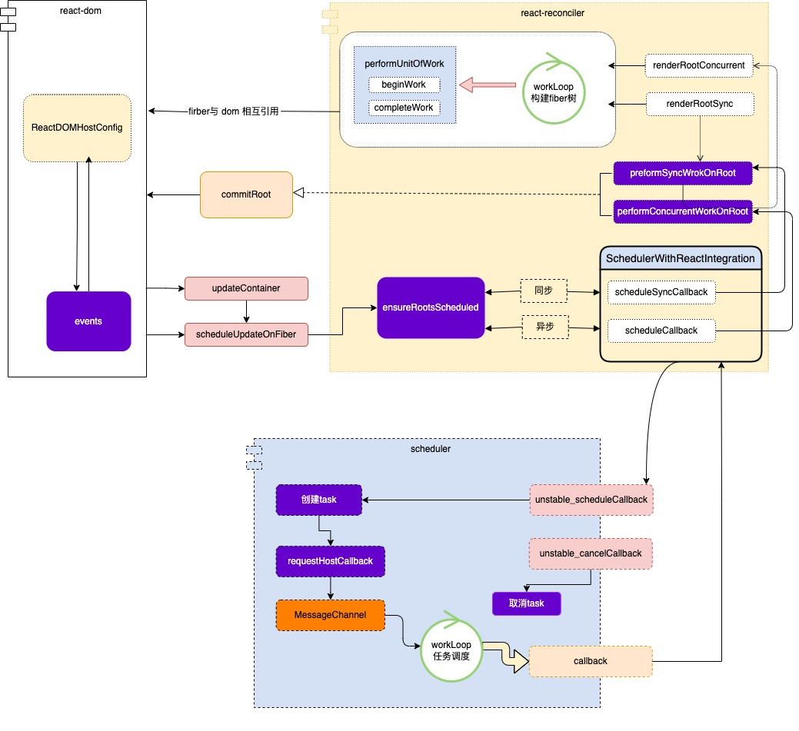
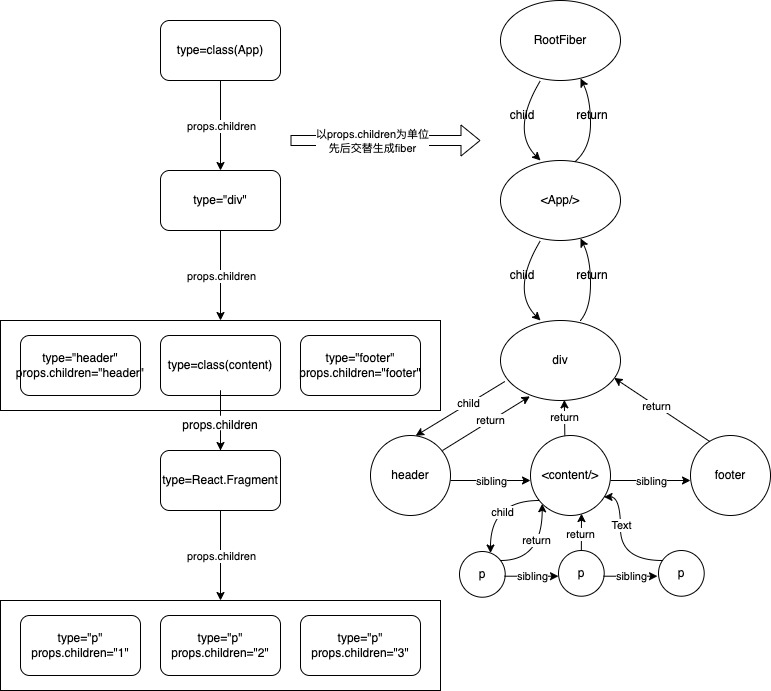
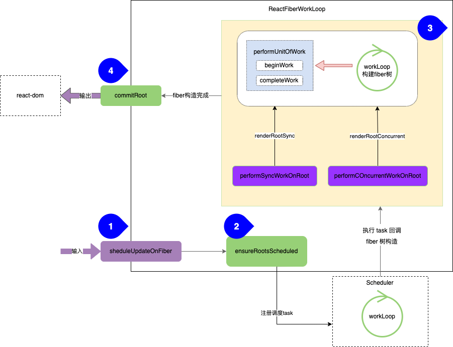
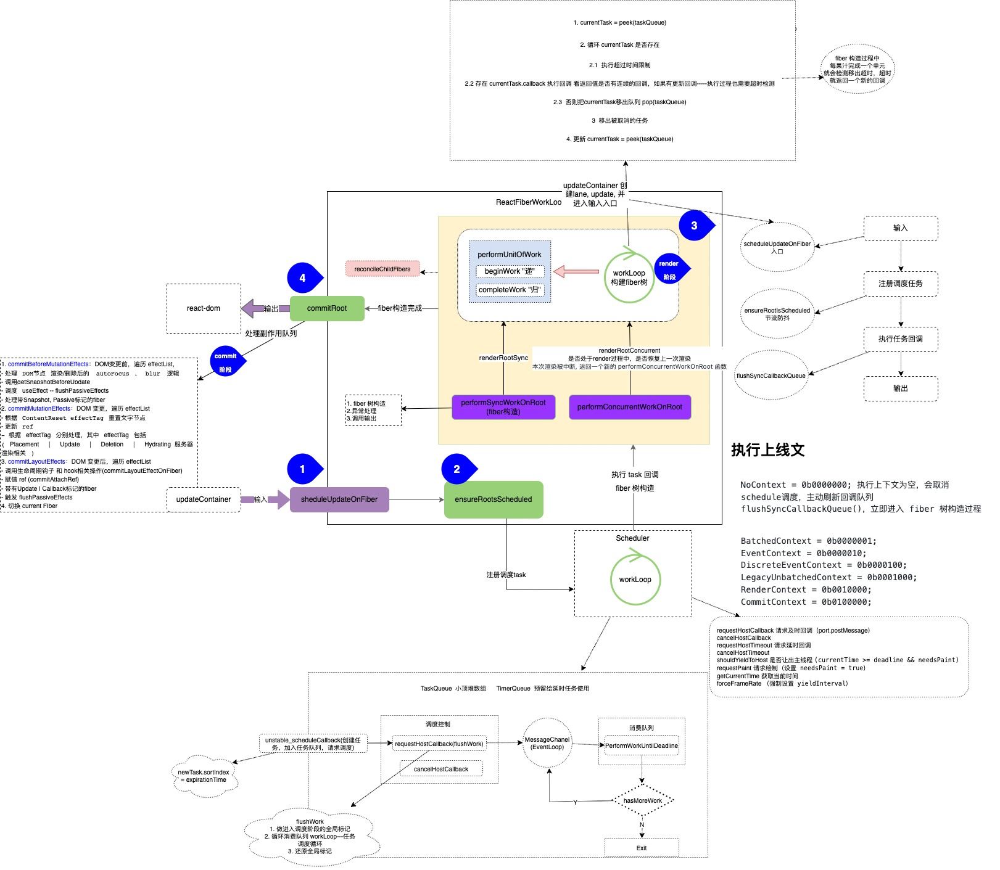

### 学习 React 相关知识

认识 React：

+ JSX 声明式的方式定义用户界面，命令式渲染，让程序一步步执行
+ 输入的数据，输出的是 UI 的描述信息
+ 组件化开发，实现复用性，通用性，跨平台
+ 异步可中断、增量更新

先看图理解其过程：

+ React 大致的执行关系，任务分配图

+ 根据ReactElement创建fiber

react-reconciler包的主要作用：

1. 输入: 暴露api函数(如: scheduleUpdateOnFiber), 供给其他包(如react包)调用.
2. 注册调度任务: 与调度中心(scheduler包)交互, 注册调度任务task, 等待任务回调.
   1. 是否需要注册新的调度
   2. 注册调度任务
3. 执行任务回调: 在内存中构造出fiber树, 同时与与渲染器(react-dom)交互, 在内存中创建出与fiber对应的DOM节点.
   1. fiber 树构造
   2. 异常处理
   3. 调用输出
4. 输出 commitRoot: 与渲染器(react-dom)交互, 渲染DOM节点.
5. 与其他模块的关系

6. 每个模块大致的功能

讲解的知识点包括：

+ [fiber](fiber.md)
+ [event](event.md)
+ [domDiff](virtualDOM.md)
+ [hooks](hooks.md)
+ [面试遇到的相关问题](question.md)
+ [React 源码整体结构](structure.md)

简单描述一帧的生命周期:

1. 一帧开始。

2. 主线程:

+ Event Handlers: `UI交互输入的事件回调`, 例如input、click、wheel等。

+ RAF: 执行`requestAnimationFrame`回调。

+ DOM Tree: 解析HTML, `构建DOM Tree`, 当JS对DOM有变更会重新触发该流程。

+ CSS Tree: `构建CSS Tree`。至此构建出Render Tree。

+ Layout: 所有元素的position、size信息。

+ Paint: 像素填充, 例如颜色、文字、边框等可视部分。

+ Composite: 绘制的指令信息`传到合成线程`中。

+ RequestIdleCallback: 如果此时一帧还有空余时间, 则执行该回调。

3. 合成线程:

   + Raster: 合成线程将`信息分块`, 并把每块发送给光栅线程, 光栅线程创建位图, 并通知GPU进程刷新这一帧。

4. 一帧结束。
