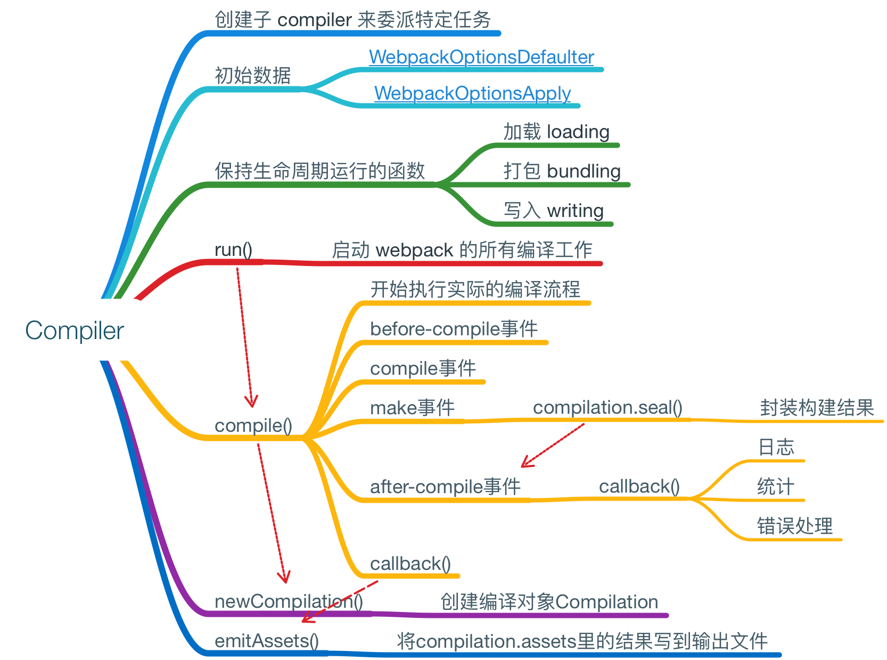
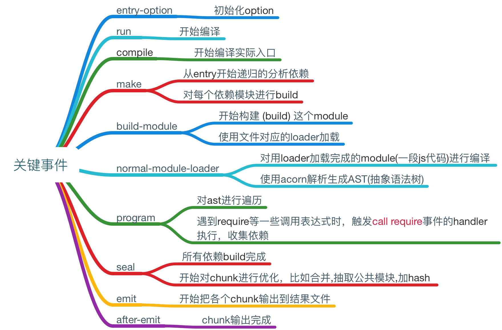

# 编写webpack插件 与 loader

- loader负责对文件进行预处理：如文件编译，vue-loader将指定格式编写的vvue组件转换为javascript模块。故编写Loader要明确自己loader的功能，要处理哪一种类型的文件及处理的结果。
    - loader本质是接收字符串(或buffer)，再返回处理的字符串(或buffer)的过程，webpack会将加载 的资源作为参数传入loader方法，交由loader处理后再返回。
    - 通过loader-utils来获取loader的配置项，根据配置项去获取相应信息。


```javascript
module.exports = function(source){
    // 对source进行处理然后返回
}
```

- 插件：compiler, compilation
    - 定义一个函数func，再设一个func.prototype.apply函数，给webpack运行时页面么题，会注入compiler对象。包含webpack运行时的参数及内置函数，可以在compilation或emit事件时使用
    - compiler还有run, watch-run的方法, compilation, normal-module-factory对象，还有compiler.plugin函数。
    - compilation对象，继承于compiler


```javascript
function func(opts){
    //参数处理
}

func.prototype.apply = function(compiler, callback){
    compiler.plugin("make", function(compilation, callback){

    });
    compiler.plugin("emit", function(compilation, callback){

    });
    compiler.plugin("compilation", (compilation)=>{
        compilation.plugin("build-module", (module)=>{

        })
        compilation.plugin("optimize-chunk-assets", (chunks, callback)=>{
            
        })
    })
}
```

## 整体流程图


## compiler代表的是配置完的webpack环境，只在webpack启动时构建一次，由webpack组件 所有的配置项构建生成，核心功能与事件



## compilation代表一次单一的版本构建和生成资源，每当检测到文件变化，一次新的编译将被创建，生成一组新的编译资源，编译对象表示：当前的模块资源，编译生成资源， 变化的文件，以及被跟踪依赖的状态信息，核心功能与事件


## Tapable实现webpack的发布与订阅，类似于NodeJs的EventEmitter，核心函数与事件
