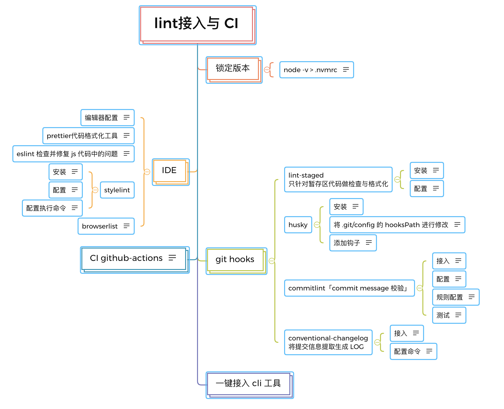

### lint 与 CI 持续集成 与 CD 持续部署

#### CI/CD 产生的发展历程

+ 最开始：资源直接 ftp 上传服务器---这种方式不安全
+ SSH 脚本部署
+ 构建服务器(脚本的一致性)---->服务器
+ docker（多构建）+ 管理 k8s + 自动构建发布平台 + 检查(持续构建、持续交付)

#### 本地代码检查

+ eslint编辑时检查 或 prettier
+ pre-commit时检查通过才可提交-----huskey, lint-stage
+ git hooks 常用的: precommit, prepush，
+ eslint-loader 构建部署检查
+ husky原理
  + 在~/.git/hooks目录，是一些可执行文件
  + 可以自定义脚本的位置，git config 'core.hooksPath' .husky
  + 在~/.husky 目录下手动创建 hook 脚本
+ gitHooks配置，yorkie fork 的 husky
+ lint-staged 变动部分检查，对暂存文件列表运行脚本

#### 实现 CI 与 CD

+ CI 持续集成
  + 借助 git hooks对当前代码在构建服务器中进行自动构建、测试及部署
    + 提交时代码检查
    + 实现自动化语法检查、测试，如果没有通过无法进行代码合并
    + 检查 `npm 库`、`构建镜像容器`的风险----synk, audit
    + 对当前分支代码构建`独立镜像`并`生成独立的分支环境地址`进行测试
    + 合并到主分支，自动构建镜像并部署到生成环境
+ CD 持续部署----免费 CICD 服务github actions
  + 分支合并自动构建(dev)
  + jenkens----发布流程
  + docker----容器，镜像-----Dockerfile
  + wayne----可视化发布平台
  + k8s----管理 docker 容器

