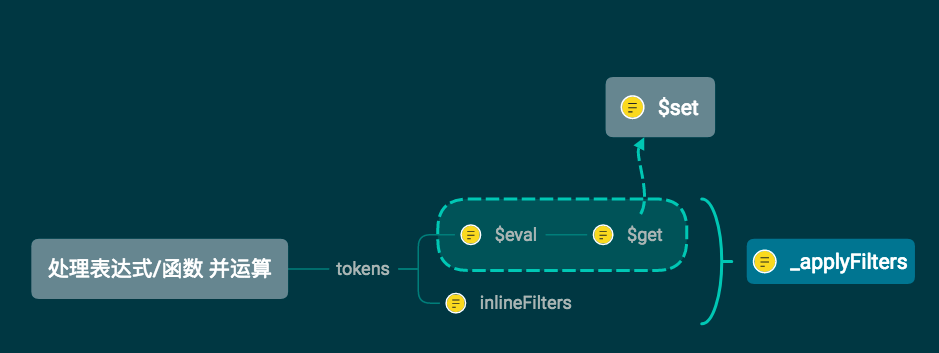

#### 表达式的运算与执行过滤



```js
// 调用this.$get获取值, 有filter时再对其进行执行_applyFilters
Vue.prototype.$eval = function (text, asStatement) {
  // 是否有filter
  if (filterRE.test(text)) {
    var dir = parseDirective(text)
    // the filter regex check might give false positive
    // for pipes inside strings, so it's possible that
    // we don't get any filters here
    var val = this.$get(dir.expression, asStatement)
    return dir.filters
      ? this._applyFilters(val, null, dir.filters)
      : val
  } else {
    // no filter
    return this.$get(text, asStatement)
  }
}
/**
  * Apply a list of filter (descriptors) to a value.
  * Using plain for loops here because this will be called in
  * the getter of any watcher with filters so it is very
  * performance sensitive.
  *
  * @param {*} value
  * @param {*} [oldValue]
  * @param {Array} filters
  * @param {Boolean} write
  * @return {*}
  */

Vue.prototype._applyFilters = function (value, oldValue, filters, write) {
  var filter, fn, args, arg, offset, i, l, j, k
  for (i = 0, l = filters.length; i < l; i++) {
    filter = filters[i]
    // 获取 options中filters
    fn = resolveAsset(this.$options, 'filters', filter.name)
    if (process.env.NODE_ENV !== 'production') {
      assertAsset(fn, 'filter', filter.name)
    }
    if (!fn) continue
    fn = write ? fn.write : (fn.read || fn)
    if (typeof fn !== 'function') continue
    args = write ? [value, oldValue] : [value]
    offset = write ? 2 : 1
    if (filter.args) {
      for (j = 0, k = filter.args.length; j < k; j++) {
        arg = filter.args[j]
        args[j + offset] = arg.dynamic
          ? this.$get(arg.value)
          : arg.value
      }
    }
    value = fn.apply(this, args)
  }
  return value
}


/**
* 插值表达式运算
*
* @param {String} text
* @return {String}
*/

Vue.prototype.$interpolate = function (text) {
    var tokens = parseText(text)
    var vm = this
    if (tokens) {
      if (tokens.length === 1) {
        return vm.$eval(tokens[0].value) + ''
      } else {
        return tokens.map(function (token) {
          return token.tag
            ? vm.$eval(token.value)
            : token.value
        }).join('')
      }
    } else {
      return text
    }
}
/**
* 获取一个vm上表达式的值
*
* @param {String} exp
* @param {Boolean} [asStatement]
* @return {*}
*/

Vue.prototype.$get = function (exp, asStatement) {
var res = parseExpression(exp)
if (res) {
  if (asStatement && !isSimplePath(exp)) {
    var self = this
    // 该函数对参数做了处理
    return function statementHandler () {
      self.$arguments = toArray(arguments)
      var result = res.get.call(self, self)
      self.$arguments = null
      return result
    }
  } else {
    try {
      return res.get.call(this, this)
    } catch (e) {}
  }
}
}

/**
* 更新一个vm上的表达式的值
*
* @param {String} exp
* @param {*} val
*/

Vue.prototype.$set = function (exp, val) {
  var res = parseExpression(exp, true)
  if (res && res.set) {
    res.set.call(this, this, val)
  }
}
```
