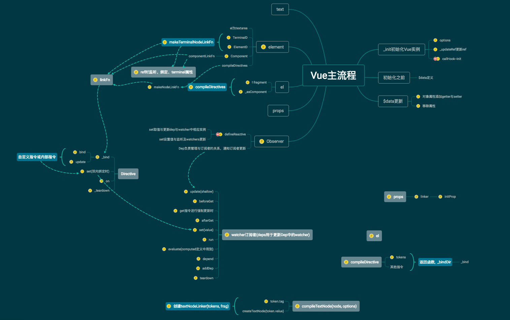

### 学习 Vue 相关知识

此博客中所分析的基于 Vue2.6.14 版本，后续会提供部分 Vue1.1 与之的对比；


Vue2.6.14 部分


```md
src
|- compiler              # 与模板编译相关的代码
|-core                   # 通用的、与运行平台无关的运行时代码
│  ├─observe        # 实现变化侦测的代码
│  ├─vdom           # 实现virtual dom的代码
│  ├─instance       # Vue.js实例的构造函数和原型方法
│  ├─global-api     # 全局api的代码
│  └─components     # 内置组件的代码
|-server            # 与服务端渲染相关的代码
├─platforms         # 特定运行平台的代码，如weex
├─sfc               # 单文件组件的解析代码
└─shared            # 项目公用的工具代码
```

+ 初始化篇：大致执行流程 与 学习Vue中所有实例方法(即所有以$开头的方法)的如何实现
+ 数据监听篇：学习Vue中如何实现数据的响应式系统，从而达到数据驱动视图
+ 编译与模板解析篇：学习Vue内部是怎么把template模板编译成虚拟DOM,从而渲染出真实DOM
+ 虚拟 DOM 篇：学习什么是虚拟 DOM，以及Vue中的DOM-Diff原理
+ 生命周期篇：学习Vue中组件的生命周期如何实现
+ 全局 API 篇：学习Vue中所有全局API的如何实现
+ 过滤器篇：学习Vue中所有过滤器的如何实现
+ 指令篇：学习Vue中所有指令的如何实现
+ 内置组件篇：学习Vue中内置组件的如何实现
+ keep-alive 使用该特性，在组件被重复创建时，会通过缓存机制快速创建组件，以提示视图更新的性能


#### 主流程结构



::: tip

主要完成三件事：

1. observer 对数据进行监听，提供订阅某个数据项的变化的能力
2. 把template模板解析成ast，在对ast进行优化，再将其生成render函数，在模板解析过程中，得到所有依赖的数据项与更新方法
3. 通过watcher把数据与依赖结合起来，把数据依赖订阅在对应数据的observer上，数据变化触发对应的视图更新方法，最后达到与模板关联的效果
:::
