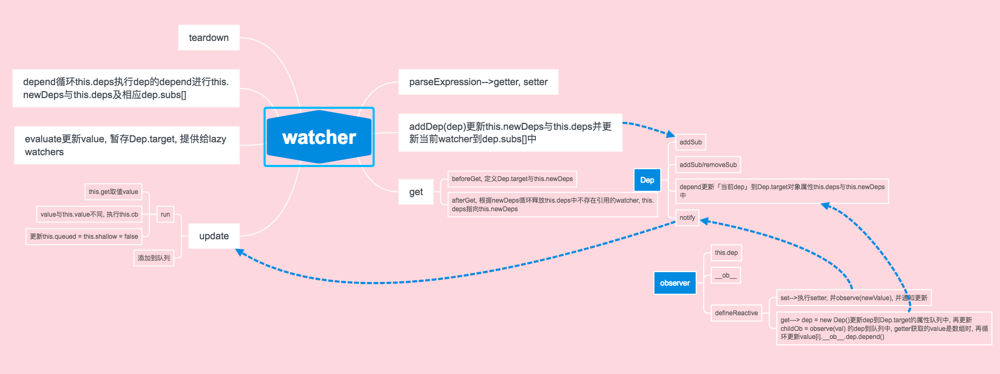

### watch

`

    let uid = 0

    /**
     * 监听表达式, 收集依赖, 当表达式值改变时触发callback
     * @param {Vue} vm
     * @param {String} expression
     * @param {Function} cb
     * @param {Object} options
     *                 - {Array} filters
     *                 - {Boolean} twoWay
     *                 - {Boolean} deep
     *                 - {Boolean} user
     *                 - {Boolean} sync  异步
     *                 - {Boolean} lazy  延迟
     *                 - {Function} [preProcess]
     *                 - {Function} [postProcess]
     * @constructor
     */

    export default function Watcher (vm, expOrFn, cb, options) {
      // mix in options
      if (options) {
        extend(this, options)
      }
      var isFn = typeof expOrFn === 'function'
      this.vm = vm
      // 更新Vue当中_watchers
      vm._watchers.push(this)
      this.expression = isFn ? expOrFn.toString() : expOrFn
      this.cb = cb
      this.id = ++uid // uid for batching
      this.active = true   // 是否存在
      this.dirty = this.lazy // lazy watcher是否已获取数据, 未获取为true
      this.deps = Object.create(null)
      this.newDeps = null
      this.prevError = null // 异步错误堆栈
      // parse expression for getter/setter
      if (isFn) {
        this.getter = expOrFn
        this.setter = undefined
      } else {
        // 解析表达式, 获取其get与set
        var res = parseExpression(expOrFn, this.twoWay)
        this.getter = res.get
        this.setter = res.set
      }
      // 是否延迟获取值
      this.value = this.lazy
        ? undefined
        : this.get()
      // 初始化数据时, 监听调用vm._digest(true)避免触发
      // state for avoiding false triggers for deep and Array
      // watchers during vm._digest()
      this.queued = this.shallow = false  // 是否为深度更新
    }

    /**
     * Add a dependency to this directive.
     * 添加一个dep到当前实例属性队列, 同时更新dep属性队列中的watcher实例
     * @param {Dep} dep
     */

    Watcher.prototype.addDep = function (dep) {
      var id = dep.id
      if (!this.newDeps[id]) {
        this.newDeps[id] = dep
        if (!this.deps[id]) {
          this.deps[id] = dep
          dep.addSub(this)
        }
      }
    }

    /**
     * Dep.target指向当前实例, 创建newDeps对象
     */

    Watcher.prototype.beforeGet = function () {
      Dep.target = this
      this.newDeps = Object.create(null)
    }

    /**
     * Evaluate the getter, and re-collect dependencies.
     */

    Watcher.prototype.get = function () {
      // 更新Dep.target 与 创建newDeps
      this.beforeGet()
      var scope = this.scope || this.vm
      var value
      // 执行getter获取值
      try {
        value = this.getter.call(scope, scope)
      } catch (e) {
        if (
          process.env.NODE_ENV !== 'production' &&
          config.warnExpressionErrors
        ) {
          warn(
            'Error when evaluating expression "' +
            this.expression + '". ' +
            (config.debug
              ? ''
              : 'Turn on debug mode to see stack trace.'
            ), e
          )
        }
      }
      // "touch" every property so they are all tracked as
      // dependencies for deep watching
      if (this.deep) {
        traverse(value)
      }
      // 执行value预处理
      if (this.preProcess) {
        value = this.preProcess(value)
      }
      // 执行filters
      if (this.filters) {
        value = scope._applyFilters(value, null, this.filters, false)
      }
      // 结束处理
      if (this.postProcess) {
        value = this.postProcess(value)
      }
      this.afterGet()
      return value
    }

    /**
     * Recrusively traverse an object to evoke all converted
     * getters, so that every nested property inside the object
     * is collected as a "deep" dependency.
     *
     * @param {*} val
     */

    function traverse (val) {
      var i, keys
      if (isArray(val)) {
        i = val.length
        while (i--) traverse(val[i])
      } else if (isObject(val)) {
        keys = Object.keys(val)
        i = keys.length
        while (i--) traverse(val[keys[i]])
      }
    }

    /**
     * Clean up for dependency collection.
     * 清除依赖集合, 根据newDeps更新deps集合
     */

    Watcher.prototype.afterGet = function () {
      Dep.target = null
      var ids = Object.keys(this.deps)
      var i = ids.length
      while (i--) {
        var id = ids[i]
        if (!this.newDeps[id]) {
          this.deps[id].removeSub(this)
        }
      }
      this.deps = this.newDeps
    }

    /**
     * Set the corresponding value with the setter.
     *
     * @param {*} value
     */

    Watcher.prototype.set = function (value) {
      var scope = this.scope || this.vm
      // 执行filters
      if (this.filters) {
        value = scope._applyFilters(
          value, this.value, this.filters, true)
      }
      // 执行setter
      try {
        this.setter.call(scope, scope, value)
      } catch (e) {
        if (
          process.env.NODE_ENV !== 'production' &&
          config.warnExpressionErrors
        ) {
          warn(
            'Error when evaluating setter "' +
            this.expression + '"', e
          )
        }
      }
      // for循环时的指令实例
      var forContext = scope.$forContext
      if (forContext && forContext.alias === this.expression) {
        if (forContext.filters) {
          process.env.NODE_ENV !== 'production' && warn(
            'It seems you are using two-way binding on ' +
            'a v-for alias (' + this.expression + '), and the ' +
            'v-for has filters. This will not work properly. ' +
            'Either remove the filters or use an array of ' +
            'objects and bind to object properties instead.'
          )
          return
        }
        forContext._withLock(function () {
          if (scope.$key) { // original is an object
            forContext.rawValue[scope.$key] = value
          } else {
            // 
            forContext.rawValue.$set(scope.$index, value)
          }
        })
      }
    }

    /**
     * 订单接口, 依赖发生改变时被调用
     * @param {Boolean} shallow
     */

    Watcher.prototype.update = function (shallow) {
      // 延迟
      if (this.lazy) {
        this.dirty = true
      // 同步
      } else if (this.sync || !config.async) {
        this.run()
      } else {
        // if queued, only overwrite shallow with non-shallow,
        // but not the other way around.
        this.shallow = this.queued
          ? shallow
            ? this.shallow
            : false
          : !!shallow
        this.queued = true
        // record before-push error stack in debug mode
        /* istanbul ignore if */
        if (process.env.NODE_ENV !== 'production' && config.debug) {
          this.prevError = new Error('[vue] async stack trace')
        }
        // 更新watcher队列
        pushWatcher(this)
      }
    }

    /**
     * Batcher job interface.
     * Will be called by the batcher.
     */

    Watcher.prototype.run = function () {
      if (this.active) {
        var value = this.get()
        if (
          value !== this.value ||
          // Deep watchers and watchers on Object/Arrays should fire even
          // when the value is the same, because the value may
          // have mutated; but only do so if this is a
          // non-shallow update (caused by a vm digest).
          ((isObject(value) || this.deep) && !this.shallow)
        ) {
          // set new value
          var oldValue = this.value
          this.value = value
          // in debug + async mode, when a watcher callbacks
          // throws, we also throw the saved before-push error
          // so the full cross-tick stack trace is available.
          var prevError = this.prevError
          /* istanbul ignore if */
          if (process.env.NODE_ENV !== 'production' &&
              config.debug && prevError) {
            this.prevError = null
            try {
              this.cb.call(this.vm, value, oldValue)
            } catch (e) {
              nextTick(function () {
                throw prevError
              }, 0)
              throw e
            }
          } else {
            this.cb.call(this.vm, value, oldValue)
          }
        }
        this.queued = this.shallow = false
      }
    }

    /**
     * 计算watcher的值, lazy watcher, compute需计算时运用
     */

    Watcher.prototype.evaluate = function () {
      // avoid overwriting another watcher that is being
      // collected.
      var current = Dep.target
      this.value = this.get()
      this.dirty = false
      Dep.target = current
    }

    /**
     * Depend on all deps collected by this watcher.
     */

    Watcher.prototype.depend = function () {
      var depIds = Object.keys(this.deps)
      var i = depIds.length
      while (i--) {
        this.deps[depIds[i]].depend()
      }
    }

    /**
     * Remove self from all dependencies' subcriber list.
     */

    Watcher.prototype.teardown = function () {
      if (this.active) {
        // remove self from vm's watcher list
        // this is a somewhat expensive operation so we skip it
        // if the vm is being destroyed or is performing a v-for
        // re-render (the watcher list is then filtered by v-for).
        if (!this.vm._isBeingDestroyed && !this.vm._vForRemoving) {
          this.vm._watchers.$remove(this)
        }
        var depIds = Object.keys(this.deps)
        var i = depIds.length
        while (i--) {
          this.deps[depIds[i]].removeSub(this)
        }
        this.active = false
        this.vm = this.cb = this.value = null
      }
    }

    Vue.prototype.$watch = function (expOrFn, cb, options) {
        var vm = this
        var parsed
        if (typeof expOrFn === 'string') {
          parsed = parseDirective(expOrFn)
          expOrFn = parsed.expression
        }
        var watcher = new Watcher(vm, expOrFn, cb, {
          deep: options && options.deep,
          sync: options && options.sync,
          filters: parsed && parsed.filters,
          user: !options || options.user !== false
        })
        if (options && options.immediate) {
          cb.call(vm, watcher.value)
        }
        return function unwatchFn () {
          watcher.teardown()
        }
      }
`

### 提供的几个方法, 更新数据都会监听并通知进行watcher更新
`

    /**
     * Intercept mutating methods and emit events
     */

    ;[
      'push',
      'pop',
      'shift',
      'unshift',
      'splice',
      'sort',
      'reverse'
    ]
    .forEach(function (method) {
      // cache original method
      var original = arrayProto[method]
      def(arrayMethods, method, function mutator () {
        // avoid leaking arguments:
        // http://jsperf.com/closure-with-arguments
        var i = arguments.length
        var args = new Array(i)
        while (i--) {
          args[i] = arguments[i]
        }
        var result = original.apply(this, args)
        var ob = this.__ob__
        var inserted
        switch (method) {
          case 'push':
            inserted = args
            break
          case 'unshift':
            inserted = args
            break
          case 'splice':
            inserted = args.slice(2)
            break
        }
        if (inserted) ob.observeArray(inserted)
        // notify change
        ob.dep.notify()
        return result
      })
    })

    /**
     * Swap the element at the given index with a new value
     * and emits corresponding event.
     *
     * @param {Number} index
     * @param {*} val
     * @return {*} - replaced element
     */

    def(
      arrayProto,
      '$set',
      function $set (index, val) {
        if (index >= this.length) {
          this.length = Number(index) + 1
        }
        return this.splice(index, 1, val)[0]
      }
    )

    /**
     * Convenience method to remove the element at given index.
     *
     * @param {Number} index
     * @param {*} val
     */

    def(
      arrayProto,
      '$remove',
      function $remove (item) {
        /* istanbul ignore if */
        if (!this.length) return
        var index = indexOf(this, item)
        if (index > -1) {
          return this.splice(index, 1)
        }
      }
    )
`

### observer 利用Object.defineProperty添加get与set, 通过递归将甩有属性添加get与set.
`

    export function defineReactive (obj, key, val) {
      var dep = new Dep()

      // cater for pre-defined getter/setters
      var getter, setter
      if (config.convertAllProperties) {
        var property = Object.getOwnPropertyDescriptor(obj, key)
        if (property && property.configurable === false) {
          return
        }
        getter = property && property.get
        setter = property && property.set
      }

      var childOb = observe(val)
      Object.defineProperty(obj, key, {
        enumerable: true,
        configurable: true,
        get: function reactiveGetter () {
          var value = getter ? getter.call(obj) : val
          // 判断是不是watcher.get调用
          if (Dep.target) {
            // dep更新到watcher的属性队列中
            dep.depend()
            if (childOb) {
              childOb.dep.depend()
            }
            if (isArray(value)) {
              for (var e, i = 0, l = value.length; i < l; i++) {
                e = value[i]
                e && e.__ob__ && e.__ob__.dep.depend()
              }
            }
          }
          return value
        },
        set: function reactiveSetter (newVal) {
          var value = getter ? getter.call(obj) : val
          if (newVal === value) {
            return
          }
          if (setter) {
            setter.call(obj, newVal)
          } else {
            val = newVal
          }
          childOb = observe(newVal)
          // 进行赋值时会触发watcher更新
          dep.notify()
        }
      })
    }
     export function Observer (value) {
      this.value = value
      this.dep = new Dep()
      def(value, '__ob__', this)
      if (isArray(value)) {
        var augment = hasProto
          ? protoAugment
          : copyAugment
        augment(value, arrayMethods, arrayKeys)
        this.observeArray(value)
      } else {
        this.walk(value)
      }
    }

    // Instance methods

    /**
     * Walk through each property and convert them into
     * getter/setters. This method should only be called when
     * value type is Object.
     *
     * @param {Object} obj
     */

    Observer.prototype.walk = function (obj) {
      var keys = Object.keys(obj)
      for (var i = 0, l = keys.length; i < l; i++) {
        this.convert(keys[i], obj[keys[i]])
      }
    }

    /**
     * Observe a list of Array items.
     *
     * @param {Array} items
     */

    Observer.prototype.observeArray = function (items) {
      for (var i = 0, l = items.length; i < l; i++) {
        observe(items[i])
      }
    }

    /**
     * Convert a property into getter/setter so we can emit
     * the events when the property is accessed/changed.
     *
     * @param {String} key
     * @param {*} val
     */

    Observer.prototype.convert = function (key, val) {
      defineReactive(this.value, key, val)
    }

    /**
     * Add an owner vm, so that when $set/$delete mutations
     * happen we can notify owner vms to proxy the keys and
     * digest the watchers. This is only called when the object
     * is observed as an instance's root $data.
     *
     * @param {Vue} vm
     */

    Observer.prototype.addVm = function (vm) {
      (this.vms || (this.vms = [])).push(vm)
    }

    /**
     * Remove an owner vm. This is called when the object is
     * swapped out as an instance's $data object.
     *
     * @param {Vue} vm
     */

    Observer.prototype.removeVm = function (vm) {
      this.vms.$remove(vm)
    }

    // helpers

    /**
     * Augment an target Object or Array by intercepting
     * the prototype chain using __proto__
     *
     * @param {Object|Array} target
     * @param {Object} proto
     */

    function protoAugment (target, src) {
      target.__proto__ = src
    }

    /**
     * Augment an target Object or Array by defining
     * hidden properties.
     *
     * @param {Object|Array} target
     * @param {Object} proto
     */

    function copyAugment (target, src, keys) {
      for (var i = 0, l = keys.length; i < l; i++) {
        var key = keys[i]
        def(target, key, src[key])
      }
    }

    /**
     * Attempt to create an observer instance for a value,
     * returns the new observer if successfully observed,
     * or the existing observer if the value already has one.
     *
     * @param {*} value
     * @param {Vue} [vm]
     * @return {Observer|undefined}
     * @static
     */

    export function observe (value, vm) {
      if (!value || typeof value !== 'object') {
        return
      }
      var ob
      if (
        hasOwn(value, '__ob__') &&
        value.__ob__ instanceof Observer
      ) {
        ob = value.__ob__
      } else if (
        (isArray(value) || isPlainObject(value)) &&
        Object.isExtensible(value) &&
        !value._isVue
      ) {
        ob = new Observer(value)
      }
      if (ob && vm) {
        ob.addVm(vm)
      }
      return ob
    }

    /**
     * Set a property on an object. Adds the new property and
     * triggers change notification if the property doesn't
     * already exist.
     *
     * @param {Object} obj
     * @param {String} key
     * @param {*} val
     * @public
     */

    export function set (obj, key, val) {
      if (hasOwn(obj, key)) {
        obj[key] = val
        return
      }
      if (obj._isVue) {
        set(obj._data, key, val)
        return
      }
      var ob = obj.__ob__
      if (!ob) {
        obj[key] = val
        return
      }
      ob.convert(key, val)
      ob.dep.notify()
      if (ob.vms) {
        var i = ob.vms.length
        while (i--) {
          var vm = ob.vms[i]
          vm._proxy(key)
          vm._digest()
        }
      }
      return val
    }

    /**
     * Delete a property and trigger change if necessary.
     *
     * @param {Object} obj
     * @param {String} key
     */

    export function del (obj, key) {
      if (!hasOwn(obj, key)) {
        return
      }
      delete obj[key]
      var ob = obj.__ob__
      if (!ob) {
        return
      }
      ob.dep.notify()
      if (ob.vms) {
        var i = ob.vms.length
        while (i--) {
          var vm = ob.vms[i]
          vm._unproxy(key)
          vm._digest()
        }
      }
    }

    /**
    * Get the value from an expression on this vm.
    *
    * @param {String} exp
    * @param {Boolean} [asStatement]
    * @return {*}
    */

    Vue.prototype.$get = function (exp, asStatement) {
    var res = parseExpression(exp)
    if (res) {
      if (asStatement && !isSimplePath(exp)) {
        var self = this
        return function statementHandler () {
          self.$arguments = toArray(arguments)
          var result = res.get.call(self, self)
          self.$arguments = null
          return result
        }
      } else {
        try {
          return res.get.call(this, this)
        } catch (e) {}
      }
    }
    }

    /**
    * Set the value from an expression on this vm.
    * The expression must be a valid left-hand
    * expression in an assignment.
    *
    * @param {String} exp
    * @param {*} val
    */

    Vue.prototype.$set = function (exp, val) {
        var res = parseExpression(exp, true)
        if (res && res.set) {
          res.set.call(this, this, val)
        }
    }

    /**
    * Delete a property on the VM
    *
    * @param {String} key
    */

    Vue.prototype.$delete = function (key) {
        del(this._data, key)
    }
`