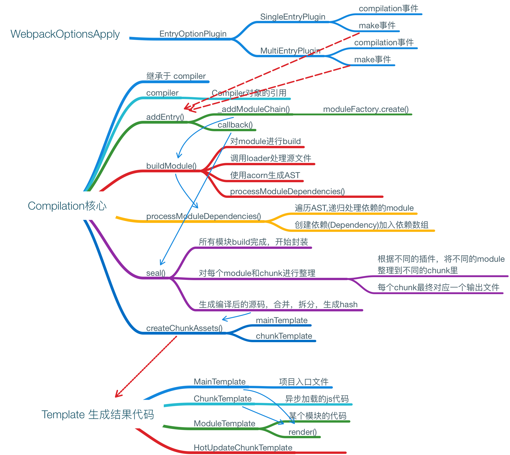
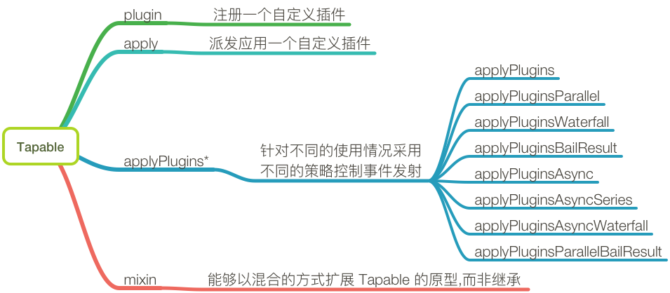

## loader 与 webpack 的区别

loader 与 plugin 的区别：loader 是转换器，plugin 是扩展器

## 开发自己的 webpack 插件

1. 开发 Plugin 的思路：
   + plugin 是通过钩子机制实现的，可以在不同的事件节点上挂载不同的任务，就可以扩展一个插件
   + 插件必须是一个包含了 apply 方法的类
   + apply 方法接收一个 compiler 参数，包含了这次构建的所有配置信息，通过这个对象注册钩子函数通过 compiler.hooks.emit.tap 注册钩子函数（emit也可以为其他事件）
   + 钩子函数第一个参数为插件名称，第二个参数 compilation 为此次打包的上下文，根据 compilation.assets 就可以拿到此次打包的资源，做一些相应的逻辑处理
   + 插件的定义域与如何执行
     + 定义一个函数func，再设一个func.prototype.apply函数，给webpack运行时页面么题，会注入compiler对象。包含webpack运行时的参数及内置函数，可以在compilation或emit事件时使用
     + compiler还有run, watch-run的方法, compilation, normal-module-factory对象，还有compiler.plugin函数。
     + compilation对象，继承于compiler

```javascript
class BasicPlugin{
   constructor(options){}
   apply(compiler){
      // 监听事件, 回调
      compiler.plugin('compilation', function(compilation){
            // compilation也提供了很多事件回调
      })
   }
}
// 或
function PluginName(opts){
    //参数处理
}

PluginName.prototype.apply = function(compiler, callback){
    compiler.plugin("make", function(compilation, callback){

    });
    compiler.plugin("emit", function(compilation, callback){

    });
    compiler.plugin("compilation", (compilation)=>{
        compilation.plugin("build-module", (module)=>{

        })
        compilation.plugin("optimize-chunk-assets", (chunks, callback)=>{

        })
    })
}
```

2. compiler代表的是配置完的webpack环境，只在webpack启动时构建一次，由webpack组件 所有的配置项构建生成，核心功能与事件


3. compilation代表一次单一的版本构建和生成资源，每当检测到文件变化，一次新的编译将被创建，生成一组新的编译资源，编译对象表示：当前的模块资源，编译生成资源， 变化的文件，以及被跟踪依赖的状态信息，核心功能与事件



4. Tapable实现webpack的发布与订阅，类似于NodeJs的EventEmitter，核心函数与事件



## 开发自己的 loader

1. babel 的步骤：分词(根据最小有效语法单元，对字符串进行切割)--->词法分析(涉及到读取、暂存、回溯、暂存点销毁等操作)---->AST(语法分析)---->输出目标代码
   + loader负责对文件进行预处理：如文件编译，vue-loader将指定格式编写的vvue组件转换为javascript模块。故编写Loader要明确自己loader的功能，要处理哪一种类型的文件及处理的结果。
     + loader本质是接收字符串(或buffer)，再返回处理的字符串(或buffer)的过程，webpack会将加载 的资源作为参数传入loader方法，交由loader处理后再返回。
     + 通过loader-utils来获取loader的配置项，根据配置项去获取相应信息。

