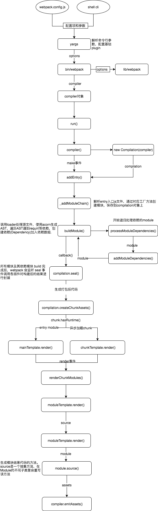

## webpack 的打包过程



1. 初始化阶段（配置文件合并、校验）
   + 初始化参数：从配置文件、配置对象和 Shell 参数中读取并与默认参数进行合并，组合成最终使用的参数。
   + 创建编译对象：用上一步得到的参数创建 Compiler 对象。
   + 初始化编译环境：包括注入内置插件、注册各种模块工厂、初始化 RuleSet 集合、加载配置的插件等。
2. 构建阶段 module
   + 开始编译：执行 Compiler 对象的 run 方法，创建 `Compilation` 对象。 该对象负责组织整个打包过程, 包含每个构建环节及输出环节所对应的方法
   + 确认编译入口：进入 `entryOption` 阶段，读取配置的 Entries，递归遍历所有的入口文件，调用 `Compilation.addEntry` 将入口文件转换为 `Dependency` 对象。
   + 编译模块（make）： 调用 `normalModule` 中的 build 开启构建，从 entry 文件开始，调用 loader 对模块进行转译处理，然后调用 JS 解释器（acorn）将内容转化为 AST 对象，然后递归分析依赖，依次处理全部文件。
   + 完成模块编译：在上一步处理好所有模块后，得到模块编译产物和依赖关系图。
3. 生成阶段 chunk
   + 输出资源（seal）：根据入口和模块之间的依赖关系，组装成多个包含多个模块的 Chunk，再把每个 Chunk 转换成一个 Asset 加入到输出列表，这步是可以修改输出内容的最后机会。
   + 写入文件系统（emitAssets）：确定好输出内容后，根据配置的 output 将内容写入文件系统。

::: tip
webpack的实际入口是Compiler中的run方法, run一量执行后, 就开始编译和构建流程了, 几个比较重要的事件节点
+ compile 开始编译
+ make 从入口点分析模块及其依赖的模块，创建这些模块对象
+ build-module 构建模块
+ after-compile 完成构建
+ seal 封装构建结果
+ emit 把各个chunk输出到结果文件
+ after-emit 完成输出
:::

## 详细的构建过程

1. 初始化
   + 将命令行参数和用户的配置文件进行合并。
   + 调用 getValidateSchema 对配置进行校验。
   + 调用 createCompiler 创建 Compiler 对象。
     + 将用户配置和默认配置进行合并处理。
     + 实例化 Compiler。
     + 实例化 NodeEnvironmentPlugin。
     + 处理用户配置的 plugins，执行 plugin 的 apply 方法。
     + 触发 environment 和 afterEnvironment 上注册的事件。
     + 注册 webpack 内部插件。
     + 触发 initialize 事件。
2. 构建阶段
   + 在实例化 compiler 之后，执行 compiler.run()。
   + 执行 newCompilation 函数，调用 createCompilation 初始化 Compilation 对象。
   + 执行 _addEntryItem 将入口文件存入 this.entries（map 对象），遍历 this.entries 对象构建 chunk。
   + 执行 handleModuleCreation，开始创建模块实例。
   + 执行 moduleFactory.create 创建模块。
     + 执行 factory.hooks.factorize.call 钩子，然后会调用 ExternalModuleFactoryPlugin 中注册的钩子，用于配置外部文件的模块加载方式。
     + 使用 enhanced-resolve 解析模块和 loader 的真实绝对路径。
     + 执行 new NormalModule()创建 module 实例。
   + 执行 addModule，存储 module。
   + 执行 buildModule，添加模块到模块队列 buildQueue，开始构建模块, 这里会调用 normalModule 中的 build 开启构建。
     + 创建 loader 上下文。
     + 执行 runLoaders，通过 enhanced-resolve 解析得到的模块和 loader 的路径获取函数，执行 loader。
     + 生成模块的 hash。
   + 所有依赖都解析完毕后，构建阶段结束。
3. 生成阶段
   + 执行 Compilation.seal 进行产物的封装。---生成产物
   + 构建本次编译的 ChunkGraph 对象，执行 buildChunkGraph，这里会将 import()、require.ensure 等方法生成的动态模块添加到 chunks 中。
   + 遍历 `Compilation.modules` 集合，将 module 按 entry/动态引入 的规则分配给不同的 Chunk 对象。
   + 调用 Compilation.emitAssets 方法将 assets 信息记录到 Compilation.assets 对象中。
   + 执行 hooks.optimizeChunkModules 的钩子，这里开始进行代码生成和封装。
     + 执行一系列钩子函数（reviveModules, moduleId, optimizeChunkIds 等）。
     + 执行 createModuleHashes 更新模块 hash。
     + 执行 JavascriptGenerator 生成模块代码，这里会遍历 modules，创建构建任务，循环使用 JavascriptGenerator 构建代码，这时会将 import 等模块引入方式替换为 webpack_require 等，并将生成结果存入缓存。
     + 执行 processRuntimeRequirements，根据生成的内容所使用到的 webpack_require 的函数，添加对应的代码。
     + 执行 createHash 创建 chunk 的 hash。
     + 执行 clearAssets 清除 chunk 的 files 和 auxiliary，这里缓存的是生成的 chunk 的文件名，主要是清除上次构建产生的废弃内容。
   + 回到 Compiler 的流程中，执行 onCompiled 回调。-----文件输出​
   + 触发 shouldEmit 钩子函数，这里是最后能优化产物的钩子。
   + 遍历 module 集合，根据 entry 配置及引入资源的方式，将 module 分配到不同的 chunk。
   + 遍历 chunk 集合，调用 Compilation.emitAsset 方法标记 chunk 的输出规则，即转化为 assets 集合。
   + 写入本地文件，用的是 webpack 函数执行时初始化的文件流工具。
   + 执行 done 钩子函数，这里会执行 compiler.run() 的回调，再执行 compiler.close()，然后执行持久化存储（前提是使用的 filesystem 缓存模式）。

```javascript
import( /* webpackPrefetch: true */ './desc').then(({ default: element }) => {
    console.log(element)
    document.body.appendChild(element)
  })

  import(/* webpackPreload: true */ 'ChartingLibrary');
```

## JS 文件配置了 eslint、typescript、babel 等 loader，他将有可能执行五次编译，被五次解析为 AST

+ acorn: 用以依赖分析，解析为 acorn 的 AST
+ eslint-parser: 用以 lint，解析为 espree 的 AST
+ typescript: 用以 ts，解析为 typescript 的 AST
+ babel: 用以转化为低版本，解析为 @babel/parser 的 AST
+ terser: 用以压缩混淆，解析为 acorn 的 AST
+ thread-loader: 多进程loder，之前的 happypack


## webpack编译的结果

1. __webpack_modules__: 维护所有依赖模块的数组，将入口模块解析为 AST，根据 AST 深度优先搜索所以模块，并构建出这个模块数组
2. 每个模块都由一个包裹函数 (module, module.exports, __webpack_require__)包裹自执行
3. __webpack_require__(moduleId) 手动加载一个模块，对已经加载过的模块进行缓存，未加载过的模块，通过 id 定位到__webpack_modules__中的包裹函数，__webpack_require__(0): 运行第一个模块，即运行入口模块
4. code spliting 如何动态加载 chunk的
   1. import() 动态加载模块
   2. __webpack_require__.e: 加载 chunk。该函数将使用 document.createElement('script') 异步加载 chunk 并封装为 Promise。
   3. self["webpackChunk"].push: JSONP cllaback，收集 modules 至 __webpack_modules__，并将 __webpack_require__.e 的 Promise 进行 resolve。

